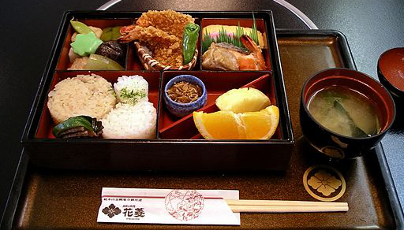
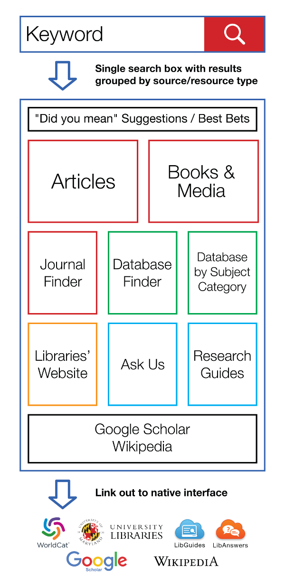

title: UMD Libraries Discovery Forum
author:
  name: Ben Wallberg
  email: wallberg@umd.edu
  url: https://github.com/wallberg-umd
theme: theme
output: index.html

--

# Bento Box Discovery

--

### What

<b>Proposal</b> - the UMD Libraries should evaluate adoption of Bento Box Discovery

--

### What

Bento Box is a style of Japanese boxed meal with compartmentalized portions

 
[Bento at Hanabishi, Koyasan (CC by 2.0)](https://en.wikipedia.org/wiki/Bento#/media/File:Bento_at_Hanabishi,_Koyasan.jpg)

--

### What

<b>Link out to native interface</b> - for each box, both for full results and individual hits; the native interface provides optimized display, navigation, and advanced search for the source data

-- 

### Search Flow

--

### Why

<b>Currently no true single search</b> 
- single search can’t happen without aggregation of data from multiple sources into single index
- WorldCat Discovery covers much, but not all

--

### Why

<b>Provide users with single search box</b> 
- familiar Google search experience 
- obviates need to know the data source upfront
- search results guide users to relevant source(s)

--

### Why

<b>Metasearch solution hasn’t worked</b> 
- single search box with federated search and real-time aggregated result list
- shown to be too slow, poor search interface and capabilities, poor vendor support

--

How
Technology - local system executes multiple searches against source system APIs, but does not attempt to aggregate the results; one open-source tool available is QuickSearch, provided by NCSU Libraries.

Evaluation process - explore publications and peer institution experiences; build prototype systems then move to beta systems for end user feedback; ensure data collection and review process in place from the start

--

### Demonstration

Using NCSU Libraries QuickSearch

- [JSTOR](http://search.lib.ncsu.edu/?q=jstor)
- [Harvard Business Review](http://search.lib.ncsu.edu/?q=harvard+business+review)
- ["University of Maryland Libraries"](http://search.lib.ncsu.edu/?q=%22university+of+maryland+libraries%22)

